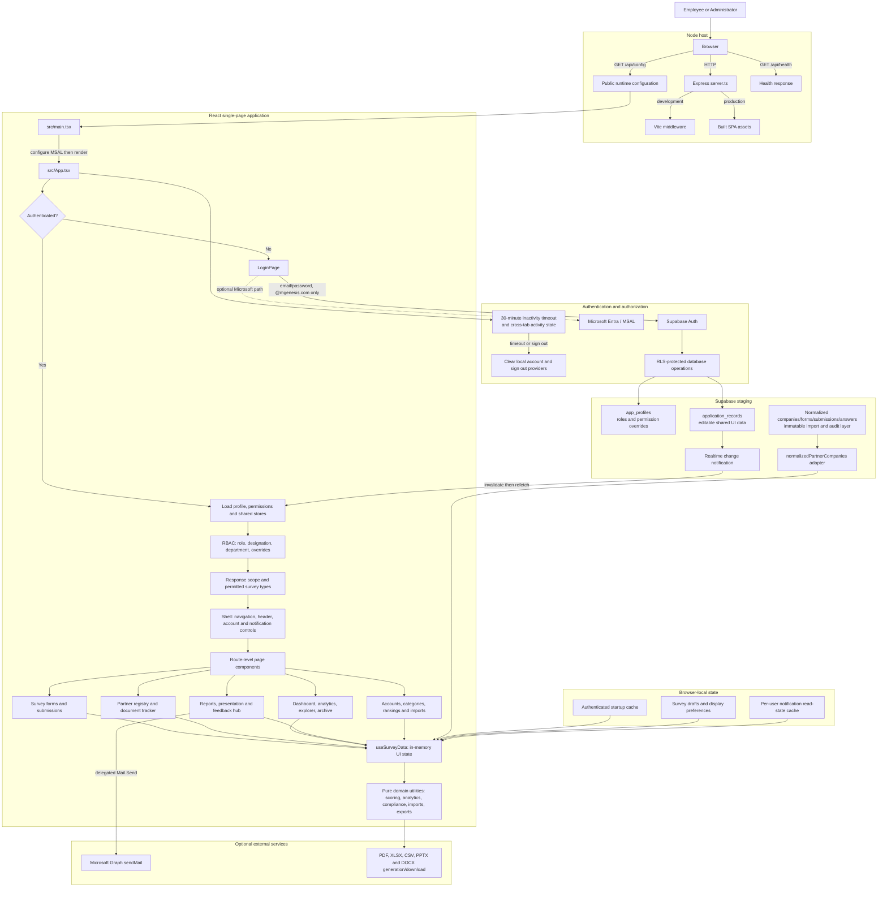
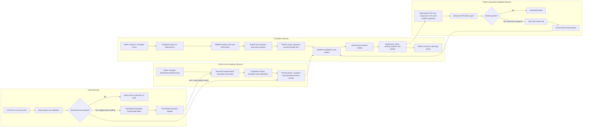

# Supplier Management System Flowchart

This diagram reflects the current codebase as of 2026-09-22. It distinguishes the editable application store from the normalized import/audit tables; the latter are not the normal UI write target.

## Main business workflows

## Key boundaries

- `src/App.tsx` owns client-side page selection, access filtering, authentication bootstrap, and Supabase-triggered refresh orchestration.
- `src/hooks/useSurveyData.ts` is the central client data store. Its shared records persist via `src/services/applicationRepository.ts`.
- Supabase RLS, rather than hidden navigation or TypeScript types, is the database authorization boundary.
- `application_records` is the editable, UI-facing shared store. The normalized tables are the staging import/audit layer.
- Local storage is intentionally limited to cache and device-specific state; it is not the shared source of truth when Supabase is configured.
- Microsoft Graph email is optional and only reports success after Graph accepts the send request.
