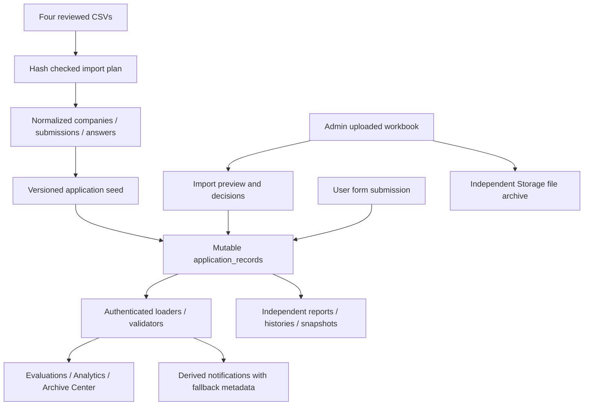

# CSV data context audit — 2026-10-02

## Scope and evidence

Requested outcome: identify test/dummy business data using the four repository CSVs as the real-data reference. This is a repository-wide data-source scan with focused tracing of reachable imports, seeds, persistence, caches, notifications, analytics, and archives; it is not a line-by-line review of every application function.

The `audit-context-building` skill supplied the context-analysis method. README, SYSTEM_TURNOVER, SECOND_BRAIN, current source, migrations, scripts, and existing working-tree differences were inspected. Three independent read-only analyses covered CSV reconciliation, runtime data, and persistence. No application code, CSVs, database rows, or uploaded files were changed. This report and the accompanying SELECT-only SQL are the only new audit artifacts.

During the initial repository scan, no Supabase connector or local/deployed browser session was available. Database conclusions at that point relied on user-reported cleanup outputs. The connected database was subsequently checked in the live follow-up below; browser storage and deployment revision remain unverified. No automated test suite or build was run for this read-only audit; the existing import planner was computed against the CSVs.

The skill's referenced supplementary output/checklist files were unavailable; its main structural checklist was followed for the central data routines below. Existing README, SECOND_BRAIN, package, importer/provenance, and cleanup-script changes were preserved.

## Verified real-data baseline

| Repository source | Source records | Evaluation submissions |
| --- | ---: | ---: |
| Master List Tracker_V4_SMS Copy.csv | 1,252 named master rows | 0 |
| Microgenesis Courier Evaluation Form.csv | 30 | 30 |
| Microgenesis Subcontractor Evaluation Form.csv | 65 | 65 |
| Microgenesis Supplier Evaluation Form.csv | 185 | 185 |
| Evaluation total | 280 | 280 |

The current reviewed import plan yields **6,355 answers**, 65 question definitions, 1,140 canonical companies, 1,251 branches, and 6,957 document metadata records. The company total comprises 1,138 distinct exact master names and two reviewed evaluation-only companies. One exact duplicate master row is collapsed. Answer statuses are 3,242 rated, 1,303 not applicable, 1,810 populated text, and zero missing. The reviewed aliases give zero blocking errors/unresolved company names; warnings cover the duplicate and a blank BP code.

| Source | Canonical SHA256 (CRLF normalized to LF) |
| --- | --- |
| Master | `82e2c6c10ec516dc52f7680f49c467276c7ed98f58b67b9d488075178a085eaa` |
| Courier | `402ee678934ba6ea71299a817bfa5a7e93969563b246273c83d05e7b35b93212` |
| Subcontractor | `3df87c2d987c8f0b0792a40e57b10803dec1926f0a7327a971bf69c6a56b646b` |
| Supplier | `b01101f4330f344005002879b2c975c8d5d8f538db174f26de14a9371187f29b` |

These match [the pinned importer](../../../scripts/supabase-import/importPlan.ts#L11). They identify the reviewed source content, not the current database state.

**No company-name field in these CSVs contains a standalone test/tests/dummy/sample/demo/QA label; no TEST company occurs.** However, real CSV remarks contain those words: Master logical record 934 has “Test” in Remarks; Supplier logical records 48/49 have “demo” in Quality Remarks and record 49 in Delivery Remarks. Logical CSV record numbers can differ from physical line numbers because quoted fields contain newlines. These are authoritative source entries and must not be classified as dummy by keyword alone.

## Inventory of remaining sources and review boundaries

| Observation | Classification and evidence |
| --- | --- |
| Five hardcoded respondent identities | **Confirmed synthetic display fallback.** [toNotification](../../../src/hooks/useSurveyData.ts#L180) supplies a role-selected identity for a missing email. These identities did not match the four CSVs. It also supplies Logistics for a missing department and can override designation based on identity. Reachable through remote hydration, refresh, and submission; shown in [notification logs](../../../src/pages/NotificationLogsPage.tsx#L324). This does not create a new evaluation or employee account. Whether current rows trigger it is unknown. |
| Company metadata defaults | **Confirmed non-source defaults for incomplete records.** [normalizePartnerCompany](../../../src/hooks/useSurveyData.ts#L142) supplies registration date 2025-01-15, Accredited status, Local supplier origin, and a blank branch. Existing properties take precedence. This does not seed a dummy company; affected live records are unknown. |
| Generic reminder sender | **Confirmed generated display metadata.** [employeeNotifications](../../../src/utils/employeeNotifications.ts#L80) uses a fixed admin sender for pending-survey reminders instead of deriving the actual creator. No independent evaluation is seeded. |
| Three historical sample feedback report IDs | **Confirmed legacy identifiers; current rows unknown.** [getSentReports](../../../src/utils/feedbackHubStore.ts#L43) filters `rpt-queued-001`, `rpt-sent-002`, `rpt-returned-003` from local results. Remote hydration loads and caches feedback reports without removing those database rows. Default reports are empty. |
| Feedback contacts, queued/sent reports and revisions | Separate persistent records and snapshots. [Feedback hydration](../../../src/utils/feedbackHubStore.ts#L96) can migrate local records when all three remote feedback collections are empty and the migration marker is absent. Contact or report absence from evaluation CSV is insufficient to establish dummy content. |
| Archive series | Separate labels can survive response/form deletion. [Core hydration](../../../src/hooks/useSurveyData.ts#L1418) can migrate old local series once for an admin when remote series are empty. An unused series is not automatically a test series. |
| Supplier ranking history | [Historical snapshots](../../../src/utils/supplierRankingLog.ts#L9) retain denormalized company names. Earlier test activity may remain independently of deleted evaluation answers. No current dummy ranking list is seeded. |
| Admin activity, exports, document modification history | Independent operational records. [Admin history](../../../src/utils/adminActivityLog.ts#L17), [export history](../../../src/utils/exportHistory.ts#L20), and [document history](../../../src/utils/documentModificationLog.ts#L42) can contain historical test labels and have legacy cache migration paths. Actual contents are unknown. |
| Compliance history | [Saved totals/rates](../../../src/utils/complianceHistory.ts#L30) describe historical states, which may precede cleanup. Absence from CSV is not a dummy classification. |
| Active-company snapshots | Uploaded snapshots persist independently. [Missing-type fallback](../../../src/features/active-companies/services/activeCompanySnapshotService.ts#L11) uses a repository CSV-derived seed: 7 Courier, 20 Supplier, 13 Subcontractor company names. The seed is reference data, not arbitrary dummy companies. Stored uploads need their own comparison. |
| Evaluation import archives | [Metadata and original uploads](../../../src/features/evaluation-imports/services/evaluationImportArchiveService.ts#L24) persist separately in application records and the `evaluation-import-archives` Storage bucket. Response/form deletion does not remove those files. Files were not inspected or deleted. |
| Core browser response/form cache | With configured Supabase, [startup](../../../src/hooks/useSurveyData.ts#L469) skips local-first boot; [hydration](../../../src/hooks/useSurveyData.ts#L1379) replaces core arrays/caches from remote rows. This path does not recreate deleted forms/answers from old core caches. Failed synchronization or a different configured project can leave a different visible state; neither was observed live. |
| Existing cleanup scripts | [Cleanup classifier](../../../scripts/database-cleanup/testEvaluationsSql.ts#L2) selects test provenance/labels and protects normalized/import records. It does **not** implement exact repository CSV content equality, and only handles evaluation answers. The user's latest CSV-only criterion is broader than the script's current contract. |

### Content that is not evidence of persisted dummy records

- `src/data` holds question definitions/categories/weights. Core companies, forms, responses, and notification states initialize empty.
- Three standard templates exist for the nonconfigured local path. Configured Supabase skips that path; template dates are not submitted evaluation data.
- Example company/contact/email text is input placeholder copy. Survey preview company choices derive from actual eligible companies; preview input is not saved.
- “Sample Size” in reports is statistical terminology; “Sample Format” documents are format references. Login “mock dashboard” comments and analytics placeholder controls do not seed business records.
- `*.test.*`, extraction/generator scripts, and root `test_single.js` are development artifacts. Static searches did not establish them as runtime database seed sources. Files were retained.
- Bootstrap admin authorization records, operational settings, documents, and histories require separate provenance decisions. A CSV-only **evaluation** baseline does not authorize deleting every non-CSV system object.

## End-to-end data model

Actors are authenticated employees submitting permitted forms and admins maintaining/importing business data. Loaders are subject to database RLS; a page's accessible subset is not a complete database inventory. Runtime payload validation can quarantine invalid rows, so missing UI records do not prove missing database rows.

Normalized import UUIDs and canonical question IDs link to the original sources. Browser imports instead use `IMPORT-<TYPE>-<source ID>`; archived wide imports use `WIDE::<type>::<company>::<email>::<date>`. Different IDs can represent source-equivalent content. Matching an original ID establishes presence only; mutable answers may have changed. [Provenance inference](../../../src/features/analytics/domain/responseProvenance.ts) and test-title visibility filters do not establish content equality with the repository CSVs.

The earlier user-reported result deleted **149 answer rows across 18 extra evaluations**, with all **280 CSV evaluations present**. A later result returned four deleted archived test templates. These results do not establish that independent histories, nested snapshots, import archives, or browser stores are clean now. Companies bearing a real name remain real companies even when a deleted sample evaluation used that name.

## Central routine context analysis

### buildImportPlan — source integrity and deterministic identities

**Purpose:** [buildImportPlan](../../../scripts/supabase-import/importPlan.ts#L376) constructs the normalized model from the four reviewed sources. It returns a plan for a later writer and performs no network mutation.

**Inputs/assumptions:** project root and reviewed aliases; readable UTF8 CSV; normalized byte checksum equals pinned content; header positions equal the form specs; master BP code/row hash is stable; evaluation source IDs are unique within a source; reviewed aliases intentionally resolve ambiguity; supported dates/ratings are interpretable.

**Blocks and ordering:** checksum/header checks precede positional parsing; named master rows build companies/branches before evaluations need their foreign keys; exact duplicates collapse while conflicting keys become issues; aliases precede name resolution; each form column produces a typed answer status and deterministic identity; summaries derive from the resulting arrays. Downstream SQL/network writers refuse blocking issues.

**First principles:** source identity must precede source interpretation. **Why/how chains:** validate bytes → trust reviewed layout → parse fixed columns; build company identities → resolve aliases → assign submission relationships; retain raw/status information → report malformed values → writer refuses an invalid plan rather than silently skipping it.

**Outputs/effects/dependencies:** file reads, cryptographic hashes, row arrays, aggregate summary/issues; PapaParse, fs/crypto, FORM_SPECS, aliases, and question mappings. Invariants: identical source inputs yield identical IDs; one answer per spec column/submission; duplicate collapse does not create another branch; unresolved names produce blocking issues. Boundary outcomes: missing files fail; parser errors throw; mismatched checksums fail; a digest proves reviewed bytes, not real-world truth.

### toNotification — source metadata becomes presentation metadata

**Purpose:** [toNotification](../../../src/hooks/useSurveyData.ts#L180) summarizes one answer group for submission notices. It uses the first answer as representative metadata and the group length as question count.

**Inputs/assumptions:** answers share a response ID; first row is representative; role can select a missing identity; email can select designation; missing department can use Logistics. These last assumptions add information that is not established by the CSV row.

**Blocks and ordering:** empty input returns null; email selection runs before designation overrides depend on it; final object copies company/date/ID and adds derived count/default department. **First principles:** missing identity does not identify a person. **Why/how chains:** missing email → role lookup → named fallback; selected email → identity rule → displayed designation; remote answer rows → response grouping → first-row summary → notification log fields.

**Outputs/effects/dependencies:** derived object/null, then hook notification state; no direct network/storage write or source-answer mutation. Invariants: empty input yields no notice; ID/company/date come from the first row; count equals group length; supplied nonempty email survives. Dependencies are grouping and UI callers; malformed, inconsistent, or stale input metadata influences the summary.

### hydrateFromSupabase / refreshRecordType — authoritative core replacement

**Purpose:** [Core hydration](../../../src/hooks/useSurveyData.ts#L1379) loads authenticated durable session data and replaces core state. Supporting labels/read-state load after the primary arrays; record-type refresh repeats the appropriate full load.

**Inputs/assumptions:** configured client; current session email matches the mounted user; fetched records validate; an empty editable company store can use normalized-company fallback; effect cancellation prevents late application; RLS defines the user's visible subset.

**Blocks and ordering:** session guard precedes parallel company/form/answer reads; normalization/fallback precedes state and cache replacement; deferred response work derives notices/compresses cache; supporting reads precede optional admin archive/category migration; realtime changes reload a relevant collection. **First principles:** replacing an array from remote rows removes absent objects from that loaded view. **Why/how chains:** deleted remote answer → absent reload result → replaced response array; empty companies → normalized fallback → reference companies; empty archive series + absent marker → legacy cache read → separate remote migration.

**Outputs/effects/dependencies:** remote reads, React state/cache writes, notification derivation, optional archive/category writes. Dependencies include auth, application repository validators, normalized company loader, compression, and grouping. Invariants: identity guard precedes application; old local core forms/answers are not uploaded by this path; archive labels are independent. Boundary outcomes: RLS can yield a subset; network failure interrupts refresh; rejected payloads can be quarantined rather than shown; missing remote supporting collections can activate migration.

### hydrateFeedbackHubFromSupabase — independent cached history

**Purpose:** [Feedback hydration](../../../src/utils/feedbackHubStore.ts#L96) loads contacts, reports and settings into browser state. It also bridges legacy cached records once when all remote feedback stores are empty.

**Inputs/assumptions:** configured authenticated client; feedback access; repository payload contracts; empty collections permit migration; local caches represent intended records; marker is valid for the current origin/project. **Blocks and ordering:** await three reads before testing joint emptiness; conditional migration reads getters and writes remote stores; then marker/cache writes and refresh event update consumers. Sample report IDs are filtered by the local getter, not the remote read.

**First principles:** a report snapshot is an independent persisted object, so deleting its source evaluation does not erase it. **Why/how chains:** all-three-empty → migration eligibility → cache upload; remote report → cache → getter → hidden sample ID; source deletion → unchanged report collection → retained historical snapshot.

**Outputs/effects/dependencies:** three reads, optional replacements/settings upsert, local caches and event; depends on shared-store hydration, repository load/replace, local getters and page subscriptions. Invariants: any nonempty remote collection blocks migration; migration marker blocks repeat migration; getter filtering never deletes a remote report. Boundary outcomes: network failure stops completion; scoped reads can appear empty; parallel writes may complete partially before a failure.

### convertWideBlocksToLegacyRows — archive import admission

**Purpose:** [Wide archive conversion](../../../src/utils/archiveResponseTransfer.ts#L323) translates table blocks into answer-like legacy rows. It supports official and unknown question headers using current/official lookups.

**Inputs/assumptions:** parsed blocks have headers/rows; filename/header evidence resolves a survey type; company cell or block title identifies a company; metadata columns are recognized; unknown values can be classified numeric/text; composite response identity is adequate for repeat imports.

**Blocks and ordering:** resolve type/build question maps before rows; find metadata columns before deriving each composite ID; collect matrix remarks before emitting question rows that reuse them; skip empty values; prefer known question IDs, otherwise create IMPORTED IDs; emit mapped rating/comment fields. There is no membership check against the four pinned CSVs in this converter.

**First principles:** successful shape conversion does not establish real-data provenance. **Why/how chains:** absent company cell → block title fallback → title enters response identity; known header → official mapping → canonical question; unknown header → numeric/text guess → imported answer. This explains a possible admission path for Summary/QA-like block titles, but does not prove which upload produced the previously removed records.

**Outputs/effects/dependencies:** rows only; no direct remote calls. Depends on type resolution, official/fallback lookups, parsing, subsequent row validation/merge and hook persistence. Invariants: empty values emit no answers; matrix remark columns emit no separate answers; identical composite metadata yields the same response ID. Boundary outcomes: malformed file parsing can fail; user-selected file content is unverified source content; later persistence can fail independently of successful conversion.

## Read-only environment reconciliation

[csv_data_audit.sql](../../../supabase/verification/csv_data_audit.sql) provides ten SELECT-only checks: record-type inventory, source digests, baseline evaluation presence, unmatched responses, exact answer/value comparison, legacy sample feedback IDs, test-looking form titles, references to removed forms, snapshot/upload metadata, and missing notification metadata. It contains no DELETE/UPDATE/INSERT or temporary-table dependency.

Results are review candidates. The content check compares the original versioned seed mapping; subsequent legitimate edits or mapping migrations can also produce differences. Top-level form references do not cover nested report revisions/body/history. Storage file contents and browser caches remain outside those SQL checks. Current normalized source tables must themselves correspond to the reviewed hashes for reconciliation to be meaningful.

## Live follow-up — 2026-10-02

The connected Supabase MCP configuration targets `adxwaxhnqxpmgjvsxgug`, the project's documented staging database. SELECT-only checks verified its four source hashes against a fresh local `buildImportPlan` using the reviewed aliases; the local plan returned zero blocking errors. This establishes the inspected project and source baseline, not a separate production database or deployed browser session.

| Check | Live result |
| --- | --- |
| Canonical and editable companies | 1,140 each; no extra/missing companies or name/ID discrepancies |
| CSV evaluations present in editable responses | Courier 30, Subcontractor 65, Supplier 185; none missing |
| Normalized and editable answers | 6,355 each; no unmatched responses or duplicate response/question pairs |
| Answer values versus versioned seed mapping | Courier 540, Subcontractor 1,560, Supplier 4,255; zero missing or differing rows |
| Forms | Only `default-courier`, `default-subcontractor`, `default-supplier`; all saved as Completed |
| Known sample feedback IDs and top-level removed-form references | Zero |
| Branches and document metadata | 1,251 branches and 6,957 document records |
| Broken normalized answer/submission/company relationships | Zero |
| Storage objects | Zero at inspection time |

The value comparison covered response ID, question ID, canonical company name, rating, and comment. It does not establish equality of every mutable metadata field. All editable response rows currently lack an explicit `dataSource`; imported identities/default-form recognition remain relevant. Existing operational histories, settings, read states, and four active-company snapshots were retained: absence from evaluation CSVs alone is not evidence that those independent record types are dummy data. Their nested contents and browser caches were not classified by this follow-up.

There were no extra companies/evaluations to remove, so no deletion, restoration, migration, or Storage change was executed. Project files and CSVs were preserved; only the audit and second-brain notes were updated.

Evidence: [company reconciliation](../../../supabase/verification/csv_company_reconciliation.sql), checks 2–8 in [data audit](../../../supabase/verification/csv_data_audit.sql), the mapping in [application persistence migration](../../../supabase/migrations/202609160002_application_persistence.sql), fresh local import-plan summary, and connected read-only SQL results. No raw customer rows or credentials were saved.

## Audit conclusion

The repository still has reachable synthetic presentation metadata and recognizes historical sample feedback IDs. No populated runtime dummy company/evaluation seed was established. The connected staging database now has no extra/missing companies or evaluations against the reviewed CSV baseline, and answer values match the versioned seed mapping. Independent histories/snapshot contents, browser caches, and any separate production environment remain outside that conclusion. No deletion or implementation change was performed.
